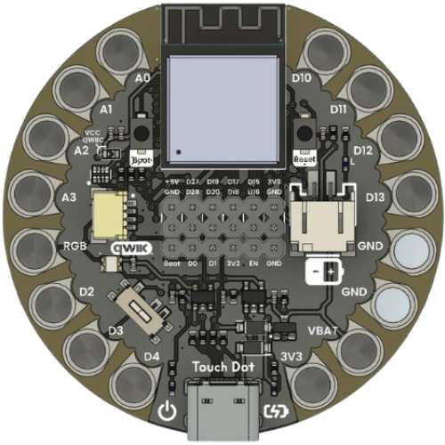

## Touchdot S3 Development Board

The Touchdot S3 is a development board based on the ESP32-S3 chip, designed for a wide range of applications such as IoT, controls, and smart devices. While it does not have the processing power to run advanced AI or machine learning models locally, it excels in versatility and ease of integration. Its compact, eye-catching design is inspired by Lilypad boards—though not identical—making it ideal for wearable and creative electronics projects. The Touchdot S3 features multiple connectivity options and a variety of peripherals, making it a great choice for rapid prototyping and embedded solutions.

<a href="#">  UNIT Touchdot S3</a>

## Microcontroller: ESP32-S3 Mini
- **Low Power Consumption**  
- **With or Without PSRAM**  
  - _Without PSRAM_: Suitable for basic projects with sensors and actuators.    
- **3.3 V Power Rail**  
  Compatible with Touchdot, QWIIC low-voltage sensors and modules, enabling easy integration into weareble prototypes.

---

## Power Supply and Battery
- **USB-C Charging and Communication**  
  Reversible USB-C port for power and programming.  
- **Integrated LiPo Battery Management**   
- **Distributed Power Pads**  
  - Magnetic connectors for **GND** and **3.3 V** distributed.  
  - Simplifies wiring to sensors, actuators, and external modules.

## Key Features
| Feature                                          | Description                                                                                                               |
|--------------------------------------------------|---------------------------------------------------------------------------------------------------------------------------|
| ✅ **USB-C Charging & Communication**             | Fast power delivery and programming; optional USB-based OTA firmware updates.                                            |
| ✅ **Wi-Fi & Bluetooth LE**                       | Dual connectivity for IoT and mobile applications.                                                                       |
| ✅ **Integrated LiPo Battery Charging**           | Safe LiPo charging without a external circuit.                                                                           |
| ✅ **Power & Reset Buttons**                      | Physical board power-on/off and reset controls.                                                                          |
| ✅ **Sewable Pads & Magnetic Connectors**         | Easy integration into mobile prototypes.                                                                                 |
| ✅ **Distributed GND & 3.3 V Pads**               | Multiple solder points to power sensors and actuators without complex wiring.                                            |
| ✅ **QWIIC Connector**                            | Standard SparkFun QWIIC I²C bus for rapid connection of compatible modules (sensors, displays, expansions).              |

