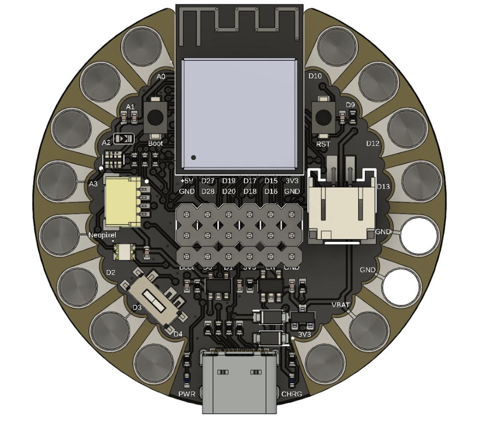

# UNIT Lily S3 Development board 

Unit Lily S3 is a development board based on the ESP32-S3 chip, designed for various applications including IoT, AI, and machine learning. It features a compact design, multiple connectivity options, and a range of peripherals to support diverse projects.

## Microcontroller: ESP32-S3 Mini
- **Low Power Consumption**  
- **With or Without PSRAM**  
  - _Without PSRAM_: sufficient for basic sensing and actuation projects.  
  - _With PSRAM (8 MB)_: recommended for embedded **AI workloads**.  
- **3.3 V Power Rail**  
  Compatible with LilyPad / QWIIC low-voltage sensors and modules, facilitating integration into wearables and textile prototypes.

---

## Power Supply and Battery
- **USB-C Charging and Communication**  
  Reversible USB-C port for power and programming.  
- **Integrated LiPo Battery Management**   
- **Distributed Power Pads**  
  - Magnetic connectors for **GND** and **3.3 V** evenly distributed.  
  - Simplifies wiring to sensors, actuators, and external modules.

## Key Features
| Feature                                          | Description                                                                                                               |
|--------------------------------------------------|---------------------------------------------------------------------------------------------------------------------------|
| ✅ **USB-C Charging & Communication**             | Fast power delivery and programming; optional USB-based OTA firmware updates.                                            |
| ✅ **Wi-Fi & Bluetooth LE**                       | Dual connectivity for IoT and mobile applications.                                                                       |
| ✅ **Integrated LiPo Battery Charging**           | Safe LiPo charging without a external circuit.                                                                           |
| ✅ **Power & Reset Buttons**                      | Physical board power-on/off and reset controls.                                                                          |
| ✅ **Sewable Pads & Magnetic Connectors**         | Easy integration into mobile prototypes.                                                                                 |
| ✅ **Distributed GND & 3.3 V Pads**               | Multiple solder points to power sensors and actuators without complex wiring.                                            |
| ✅ **QWIIC Connector**                            | Standard SparkFun QWIIC I²C bus for rapid connection of compatible modules (sensors, displays, expansions).              |

## UNIT LilyPad S3

<a href="#">  UNIT LilyPad S3</a>