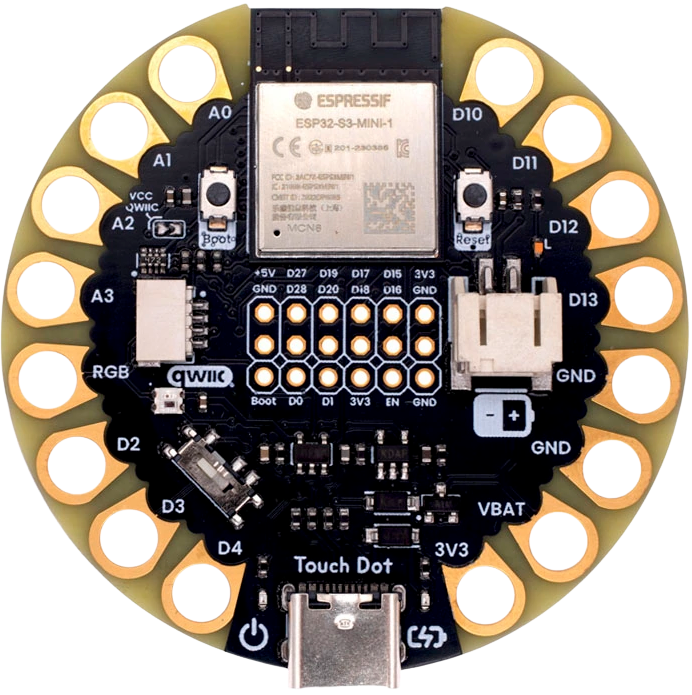

## Touchdot S3 – Inspired by Lilypad Design

Leveraging the ESP32-S3 chip, the Touchdot S3 is a versatile development board crafted for creative wearables, IoT implementations, and smart devices. Inspired by the Lilypad aesthetic but delivering modern functionality, it marries a compact form factor with robust connectivity and power management features for seamless prototyping.

  
  
UNIT Touchdot S3

### Additional Resources

### Quick Setup

### Microcontroller: ESP32-S3 Mini

- **Energy Efficient:** Optimized for low power consumption.
- **3.3 V Power Rail:** Compatible with wearable sensors and peripherals like QWIIC modules.
- **Wi-Fi and Bluetooth 5:** Supports 2.4 GHz Wi-Fi (802.11 b/g/n) and Bluetooth Low Energy subsystem
- **CPU:** Xtensa® dual-core 32-bit LX7 microprocessor
- **Memory:** 384 KB Rom, 512 KB SRAM, and 16 KB SRAM in RTC  

### Power Supply & Battery Management

- **USB-C Charging & Communication:** Ensures reliable power delivery and straightforward programming.
- **Integrated LiPo Battery Management:** Streamlines power safety and efficiency without extra circuitry.

### GPIOs

- **Sewable Pads:** 16 sewable pads in total: 11 programmable multiplexed GPIOs, 1 for Neopixel output data, and 4 for power supply.
- **Pin Headers:** 18 pin headers complement the sewable pads; use these to access more GPIOs and functions such as boot or enable.

### Key Features

| Feature                                    | Description                                                                                                     |
|--------------------------------------------|-----------------------------------------------------------------------------------------------------------------|
| **Wi-Fi & Bluetooth LE**                   | Dual wireless connectivity for seamless IoT and mobile interactions.                                            |
| **Built-in LiPo Charging**                 | Reliable battery charging integrated into the board design.                                                     |
| **Power & Reset Controls**                 | Direct access to board power management with dedicated buttons for power and reset.                             |
| **Sewable Pads & Magnetic Connectors**     | Ideal for wearable projects and rapid prototyping with flexible module integration.                             |
| **Multiple Solder Points for GND & 3.3 V** | Facilitates easy wiring to external sensors or actuators without complex setup.                                 |
| **Standard QWIIC Connector**               | Supports quick connection of I²C peripherals such as sensors, displays, and expansion modules.                  |
| **Power On Switch**                        | Easily turn on the device with an SPST switch.                                                                  |
| **Built-In LED**                           | LED connected to D13.                                                                                           |
| **RGB LED**                                | Neopixel 2020 LED, data input connected to D25 and data output to a sewable pad.                                |
| **Micro SD Slot**                          | Manage data on Micro SD cards with the SPI protocol.                                                            |

### License

This project is licensed under the MIT License.

