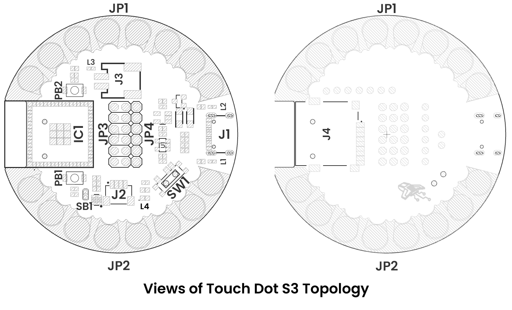

# Hardware

<a href="#">  Schematics</a>

---

## PINOUT

<a href="#">  Pinout</a>

| **Group**     | **Availables pins** | **Suggested use**                      |
|-------------  |------------------   |---------------                         |
| **GPIO**      | D2 to D13           | Sensors, actuators                     |
| **UART**      | Tx and Rx           | Serial comunication                    |
| **TouchPad**  | T1 to T11           | Capacitive sensors for touch detection |
| **Analogic**  | A0 to A8            | 12 bits (0–4095) resolution            |
| **SPI**       | Optional            | Displays, aditional memory             |

---

## Topology

<a href="#">  Topology</a>

| Ref.  | Description                                                                 |
|-------|-----------------------------------------------------------------------------|
| IC1   | Espressif ESP32-S3                                                          |
| U1    | AP2112K 3.3V LDO Voltage Regulator                                          |
| PB1   | Boot Push Button                                                            |
| PB2   | Reset Push Button                                                           |
| SW1   | Power On Switch                                                             |
| L1    | Power On LED                                                                |
| L2    | Charge On LED                                                               |
| L3    | Built-in LED (GPIO 6 or D13)                                                |
| L4    | WS2812B-2020 LED                                                            |
| SB1   | Solder bridge for enable QWIIC VCC                                          |
| J1    | Male USB Type-C Connector                                                   |
| J2    | Low-Power I2C-QWIIC JST Connector                                           |
| J3    | PH2.0 mm Pitch Battery Connector                                            |
| J4    | Micro SD Slot                                                               |
| JP1   | Sewable Pads                                                                |
| JP2   | Sewable Pads                                                                |
| JP3   | GPIO, system and Power Supply Pin Headers                                   |
| JP4   | GPIO, system and Power Supply Pin Headers                                   |
