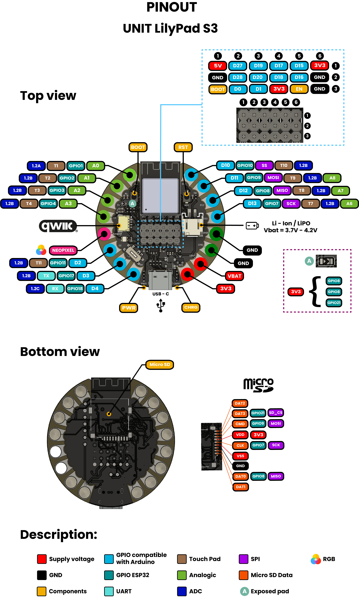

# Hardware

<a href="#">  Schematics</a>

---

## PINOUT

<a href="#">  Pinout</a>

| **Group**     | **Availables pins** | **Suggested use**                      |
|-------------  |------------------   |---------------                         |
| **GPIO**      | D2 to D13           | Sensors, actuators                     |
| **UART**      | Tx and Rx           | Serial comunication                    |
| **TouchPad**  | T1 to T11           | Capacitive sensors for touch detection |
| **Analogic**  | A0 to A8            | 12 bits (0–4095) resolution            |
| **SPI**       | Optional            | Displays, aditional memory             |

