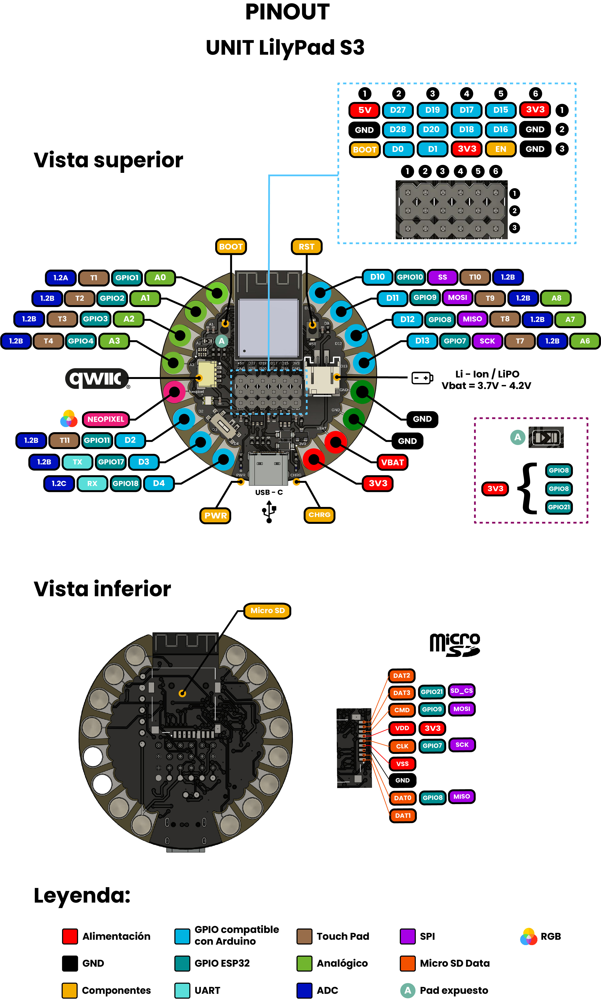

<!--
# README_TEMPLATE.md
Este archivo sirve como entrada para generar un PDF técnico estilo datasheet.
Edita las secciones respetando el orden, sin eliminar los encabezados.
-->
 <!-- logo -->

# ESP32-S3 Development Board 

## Introduction

Unit Lily S3 is a compact development board powered by the versatile ESP32-S3 chip, engineered for IoT, AI, and machine learning applications. Its design integrates the efficient ESP32-S3 Mini microcontroller—with low power consumption and an optional PSRAM configuration—to support both basic sensor projects and advanced prototypes. Additionally, the 3.3V power rail facilitates seamless connectivity with low-voltage components such as LilyPad and QWIIC sensors.

## Functional Description
<!-- No features listed yet -->

- (coming soon)

## Electrical Characteristics & Signal Overview

<!-- No usage examples provided -->

- (coming soon)

## Applications

- (coming soon)

## Features

- (coming soon)

## Pin & Connector Layout

| Group     | Availables pins | Suggested use                          |
|-----------|-----------------|----------------------------------------|
| GPIO      | D2 to D13       | Sensors, actuators                     |
| UART      | Tx and Rx       | Serial comunication                    |
| TouchPad  | T1 to T11       | Capacitive sensors for touch detection |
| Analogic  | A0 to A8        | 12 bits (0–4095) resolution            |
| SPI       | Optional        | Displays, aditional memory             |

## Settings

### Interface Overview

| Interface  | Signals / Pins            | Typical Use                                         |
|------------|----------------------------|-----------------------------------------------------|
| -       | - | -       |

###  Supports 

| Symbol | I/O   | Description                         |
| ------ | ----- | ----------------------------------- |
| VCC    | Input | Power supply (3.3V or 5V)           |

## Block Diagram

## Dimensions

## Usage

Works with:

- (coming soon)

## Downloads

- [Schematic PDF](docs/schematic.pdf)

## Purchase

- [Buy from UNIT Electronics](https://www.uelectronics.com)
